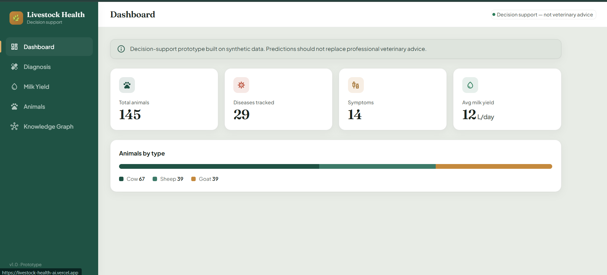
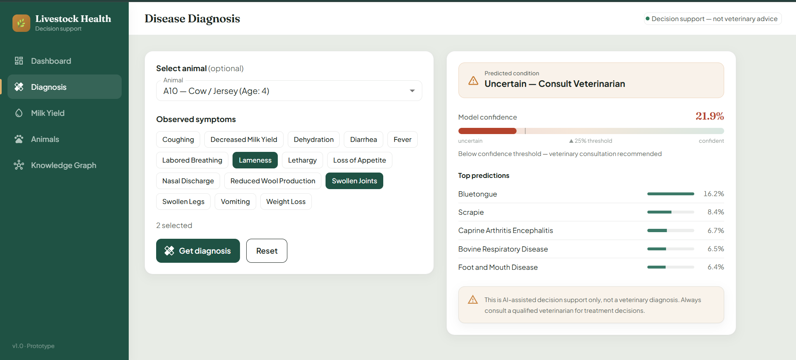

# Livestock AI Health Monitor

A decision-support web app for livestock disease triage and milk yield estimation, backed by a Neo4j knowledge graph.

**Live demo → [livestock-health-ai.vercel.app](https://livestock-health-ai.vercel.app)**

> ⏳ The backend runs on Render's free tier and sleeps after inactivity — the **first load can take up to 50 seconds** while it wakes. Subsequent requests are fast.



---

## What it does

**Disease triage.** Select observed symptoms → the model returns a ranked list of probable conditions with calibrated confidence, enriched with context from the knowledge graph (typical symptoms for that disease, number of known cases).

**Confidence guardrail.** If the top prediction falls below 25% confidence, the app returns **"Uncertain — Consult Veterinarian"** instead of a confident-looking guess. This is the core design decision of the project: a wrong answer delivered confidently is worse than an honest refusal.



**Milk yield estimation.** Breed, age, and weight → estimated daily yield in litres.

**Knowledge graph.** Animals, diseases, and symptoms with their relationships, browsable in the UI.

---

## Architecture

```
React + MUI  ──HTTPS──▶  Flask API  ──Bolt──▶  Neo4j AuraDB
  (Vercel)                (Render)              (Aura Free)
                              │
                              ▼
                        scikit-learn
                   (disease classifier,
                    yield regressor)
```

| Layer | Tech | Hosting |
|-------|------|---------|
| Frontend | React 18, Material UI 5, react-router 6, axios | Vercel |
| Backend | Flask, flask-cors, gunicorn | Render |
| Database | Neo4j AuraDB (Cypher) | Neo4j Aura Free |
| ML | scikit-learn — calibrated LogisticRegression, RandomForest | bundled with backend |

### Graph schema

```
(:Animal {animalId, animalType, breed, age, gender, weight})
(:Disease {name})
(:Symptom {name})
(:MilkRecord {animalId, breed, age, weight, milkYield})

(Animal)-[:EXHIBITS]->(Symptom)
(Animal)-[:PREDICTED_WITH]->(Disease)
(Animal)-[:HAS_MILK_RECORD]->(MilkRecord)
(Disease)-[:HAS_SYMPTOM {count}]->(Symptom)
```

Live contents: **145 animals** (Cow 67 / Sheep 39 / Goat 39), **29 diseases**, **14 symptoms**, **67 milk records**, ~840 relationships.

---

## Honest limitations

Full detail in [DATA.md](backend/data/DATA.md) and [MODEL.md](backend/models/MODEL.md). The short version:

- **The training data is synthetic.** 431 source records (146 after filtering to livestock). Predictions are **not clinically validated** and must not be used for real veterinary decisions.
- **Disease model accuracy is ~24%** (5-fold CV) against a 14% majority-class baseline. Better than chance, not reliable. With 146 samples across 15 classes, several diseases have too few examples to learn — those are grouped into a "Rare — Consult Veterinarian" bucket rather than predicted individually.
- **The milk model barely beats the mean.** MAE 3.80 L/day vs a 3.64 baseline, R² 0.669 on 67 records. Included for completeness; treat the number as a ballpark.
- **The original design claimed milk *quality* grading** from biochemical parameters (fat, protein, pH, somatic cell count, bacteria). No such data existed in the source. The feature was renamed to **yield estimation** — what the data can actually support.
- **The graph does not yet feed the model.** Neo4j provides storage, relationship context, and enrichment of results. The classifier consumes a symptom vector only. Adding graph-derived features (symptom co-occurrence, IDF-style symptom specificity, disease similarity) is the next planned step — and will be measured against the current baseline rather than assumed to help.

**This is a decision-support prototype, not a veterinary diagnostic tool.**

---

## Running locally

### Prerequisites
Python 3.11+, Node 18+, and a free [Neo4j AuraDB](https://console.neo4j.io) instance.

### Backend

```bash
cd backend
python -m venv .venv
.venv\Scripts\activate        # Windows
# source .venv/bin/activate   # macOS/Linux
pip install -r requirements.txt

cp .env.example .env          # then fill in your Aura credentials

# Rebuild everything from raw data:
cd data && python clean_data.py && cd ..
python database/seed_graph.py --execute
python models/train_all.py

python app.py                 # http://localhost:5000
```

### Frontend

```bash
cd frontend
npm install
npm start                     # http://localhost:3000
```

### Environment variables

**Backend** (`backend/.env`):
```
NEO4J_URI=neo4j+s://<instance-id>.databases.neo4j.io
NEO4J_USER=<see note below>
NEO4J_PASSWORD=<your password>
```

**Frontend** (Vercel / `.env`):
```
REACT_APP_API_URL=https://your-backend.onrender.com/api
```

> ⚠️ **AuraDB username gotcha:** the username is *usually* `neo4j`, but instances created through certain flows use the **instance ID** instead (e.g. `0862d318`). If you get `Neo.ClientError.Security.Unauthorized` with credentials you know are correct, try the instance ID as the username. This cost me a couple of hours.

---

## Reproducibility

The database is disposable; the pipeline is the source of truth.

```
raw CSV/XLSX  →  clean_data.py  →  cleaned/  →  seed_graph.py  →  Neo4j
                                       │
                                       └──────→  train_all.py  →  .pkl + metrics
```

Every step is scripted with fixed random seeds. If the Aura instance is deleted (free instances are purged after 90 days paused — this happened during development), the entire graph rebuilds in about a minute.

`clean_data.py` also handles the messy parts of the source data: merging duplicate disease labels (five spellings of "Bluetongue" → one), standardising symptom names, filtering out non-livestock species (dogs, cats, horses, pigs, rabbits left over from the source dataset), and validating domain ranges for age and weight.

---

## API

| Endpoint | Method | Purpose |
|----------|--------|---------|
| `/api/health` | GET | Service + database + model status |
| `/api/stats` | GET | Dashboard counts from the graph |
| `/api/animals` | GET | List animals (optional `?type=Cow`) |
| `/api/animals/<id>` | GET | One animal with symptoms and disease |
| `/api/diagnose` | POST | `{symptoms: [...]}` → ranked predictions |
| `/api/milk-estimate` | POST | `{breed, age, weight}` → yield estimate |
| `/api/vocab` | GET | Symptom / disease / animal-type vocabulary |
| `/api/graph-data` | GET | Nodes + links for visualisation |
| `/api/diseases` | GET | Diseases with symptom counts |

---

## Roadmap

- [ ] Graph-derived features feeding the classifier, measured against the current baseline
- [ ] Interactive D3 force-graph visualisation
- [ ] Real (non-synthetic) training data, if a suitable licensed source can be found

---

## Disclaimer

This tool is for educational and research purposes. It is **not** a substitute for professional veterinary diagnosis or treatment. Always consult a qualified veterinarian for animal health decisions.

## License

MIT